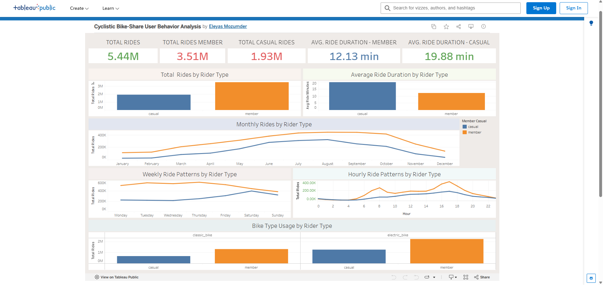

# Tableau Dashboard

## Cyclistic Bike-Share User Behavior Analysis

This Tableau dashboard analyzes differences in usage patterns between **annual members and casual riders** using 12 months of Cyclistic bike-share data from January to December 2025.

### Dashboard Includes

- Total rides by rider type
- Average ride duration
- Monthly ride patterns
- Weekly ride patterns
- Hourly ride patterns
- Bike type usage

### Interactive Dashboard

[View the interactive Tableau dashboard on Tableau Public](https://public.tableau.com/app/profile/eleyas.mozumder/viz/Book1_17876330302320/CyclisticBike-ShareUserBehaviorAnalysis)

### Dashboard Preview

